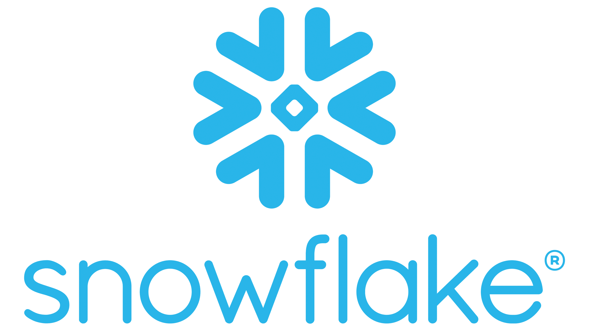
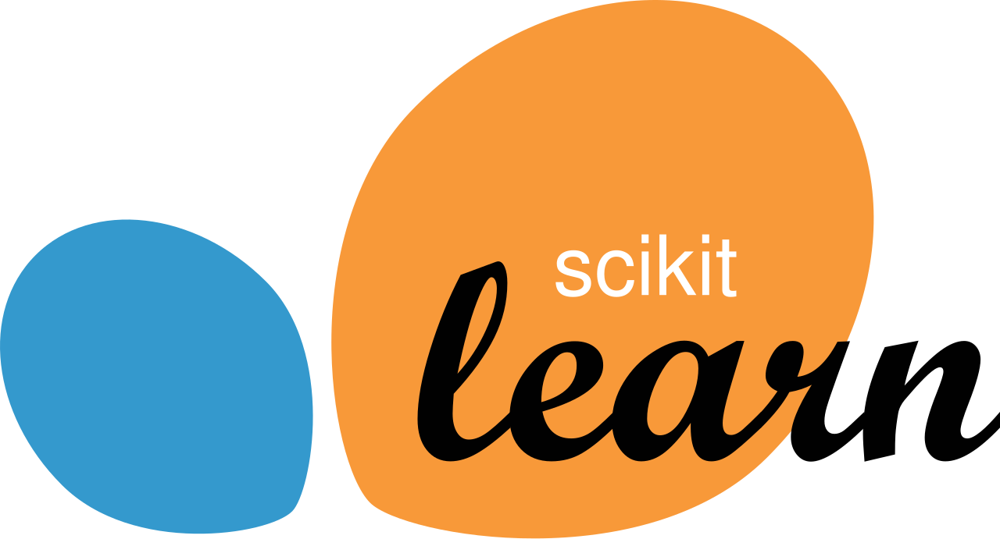

  

AI Engineer @Orano • CentraleSupélec • Data & AI Systems

## About Me

- I design and deploy AI solutions for real-world industrial use cases  
- Background in Data Science and AI systems  
- I'm passionate about AI and its potential to transform industries and improve lives. I enjoy working on projects on my free time to explore new AI techniques and applications.  

  

  

 

## My Skill Set  
<table><tr><td valign="top" width="33%">

### Databases & Big Data

  
  
  

  

 

</td><td valign="top" width="33%">

### Python & AI  

  
  

  
 
  
  

 
 

</td><td valign="top" width="33%">

### MLOps  

  
  
  
  
  
  
  

</td></tr></table> 

## Connect with me  

  

## Commits Animation
<picture>
  <source media="(prefers-color-scheme: dark)" srcset="https://raw.githubusercontent.com/Lahdhirim/Lahdhirim/output/pacman-contribution-graph-dark.svg">
  <source media="(prefers-color-scheme: light)" srcset="https://raw.githubusercontent.com/Lahdhirim/Lahdhirim/output/pacman-contribution-graph.svg">
  
</picture>